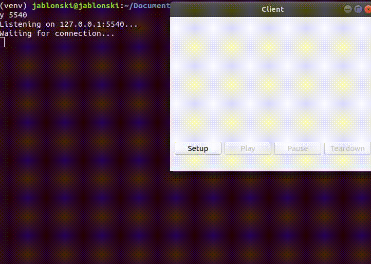

# RTSP/RTP Client and Server
 Python implementation of the [Programming Assignment 7](http://media.pearsoncmg.com/aw/aw_kurose_network_3/labs/lab7/lab7.html), from the book "Computer Networking A Top-Down Approach 3rd Edition" by Jim Kurose. Probably different assignment for newer editions of the book.
 
 Implements basic RTSP/RTP streaming functionality from the ground up. Further info available in the [assignment guide](http://media.pearsoncmg.com/aw/aw_kurose_network_3/labs/lab7/lab7.html). Exception handling is very minimal, so expect having to reopen the server/client after a previous session is finished.



## Installation

Clone the repository with `git clone https://github.com/gabrieljablonski/rtsp-rtp-stream`.

Having python>=3.6 installed, create a virtual environment by running `python -m venv venv` inside the cloned folder.

Activate the virtual environment (`source venv/bin/activate` on Linux, `.\venv\Scripts\activate` on Windows).

Install the requirements with `python -m pip install -r requirements.txt`.

## Usage

Server should be run first with `python main_server.py <port>`, where `port` is the port number for the RTSP socket to listen on.

Client can then be run with 
```
python main_client.py <file name> <host address> <host port> <RTP port>
```
where `file name` is the name for the file to be sent via RTP (`movie.mjpeg` is the available sample), `host address` is the server address (`localhost` if running on same machine), `host port` is the port selected when running the server, `RTP port` is the port for receiving the video via RTP.

Since you're probably running each instance on separate terminals, remember to activate the venv on both.

Suggested configs are:
```
python main_server.py 5540
python main_client.py movie.mjpeg localhost 5540 5541
```
